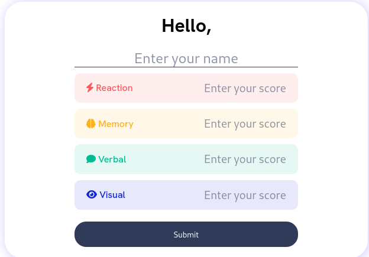

# Frontend Mentor - Results summary component solution

This is a solution to the [Results summary component challenge on Frontend Mentor](https://www.frontendmentor.io/challenges/results-summary-component-CE_K6s0maV). Frontend Mentor challenges help you improve your coding skills by building realistic projects. I added one page to the challenge and made it fully functional.

## Table of contents

- [Overview](#overview)
  - [The challenge](#the-challenge)
  - [Screenshot](#screenshot)
  - [Links](#links)

## Overview

### The challenge

This challenge is to build a summary calculator that is fully functional

### Screenshot

### Links

- Solution URL: [here](https://github.com/mikky-j/Personal-Summary-Calculator)
- Live Site URL: [here](https://mikky-j.github.io/Personal-Summary-Calculator/)
